# ITSthe1.ID API — A Beginner's Guide

> **How this guide was made:** every statement here was taken from the **source code** (`run.py`, `app/…`, `*.spec`, `*.ps1`). The existing README and other files in `docs/` were deliberately **not** used. File links point to the code so you can check each part yourself.
>
> The diagrams are written in **Mermaid**. They show up as pictures on GitHub, GitLab, and in VS Code (with the *Markdown Preview Mermaid Support* extension).

---

## Table of contents

1. [What is this project? (in one minute)](#1-what-is-this-project-in-one-minute)
2. [Words you need to know first](#2-words-you-need-to-know-first)
3. [What technologies are used?](#3-what-technologies-are-used)
4. [The big picture](#4-the-big-picture)
5. [Folder map — where is everything?](#5-folder-map--where-is-everything)
6. [What happens when you start the program](#6-what-happens-when-you-start-the-program)
7. [What happens when a request arrives](#7-what-happens-when-a-request-arrives)
8. [The database — tables and how they connect](#8-the-database--tables-and-how-they-connect)
9. [The life of a hotel stay](#9-the-life-of-a-hotel-stay)
10. [Every endpoint, explained](#10-every-endpoint-explained)
11. [Deep dive: creating a check-in (`POST /checkin`)](#11-deep-dive-creating-a-check-in-post-checkin)
12. [Deep dive: the other write operations](#12-deep-dive-the-other-write-operations)
13. [Helper tools (`app/utilities`)](#13-helper-tools-apputilities)
14. [Monitoring, logs and the tray icon](#14-monitoring-logs-and-the-tray-icon)
15. [Configuration (`config.json`)](#15-configuration-configjson)
16. [Building the `.exe` and other scripts](#16-building-the-exe-and-other-scripts)
17. [How to run it yourself](#17-how-to-run-it-yourself)
18. [Things to watch out for (found in the code)](#18-things-to-watch-out-for-found-in-the-code)
19. [Glossary of error codes](#19-glossary-of-error-codes)

---

## 1. What is this project? (in one minute)

This project is a **web API for a hotel's guest registration system**. It is called **"ITSthe1.ID API"** ([app/version.py](../app/version.py)).

Think of it as the **back office clerk** that sits between the hotel's front-desk software and the hotel's database:

- The front-desk program (the "client") says: *"Guest John Smith, passport X123, is checking into room 204, paid cash."*
- This API **checks** that everything is correct (the room exists and is free, the passport is not expired, the dates make sense…).
- Then it **saves** everything into a **SQL Server database**, stores the photos of the guest's passport/ID on disk, and marks the room as occupied.
- Later, the client can ask it to **check a guest out**, **move them to another room**, **add a family member**, **cancel the stay**, and so on.

It runs as a small program on a **Windows** computer (usually as `run.exe`) with a **system tray icon** near the clock.

> 💡 **Fun detail from the code:** many tables have a column called `DtcmCode`, `CidCode` or `DctCode`, and the `log` table has `DtcmStatus` and `CidStatus`. These look like codes for outside government/tourism reporting systems. **This API never contacts those systems itself** — it only stores the codes and writes the status as `-1` (meaning "not sent yet"). Another program probably reads the `log` table and does the reporting. *(That last sentence is a guess; the code doesn't say who does it.)*

---

## 2. Words you need to know first

| Word | Simple meaning |
|---|---|
| **API** | A program that other programs talk to over the network, instead of a person clicking buttons. |
| **Endpoint** | One "address" of the API, like `/checkin` or `/room`. Each does one job. |
| **HTTP method** | The *verb* of a request. `GET` = read, `POST` = create, `PUT` = update. |
| **JSON** | The text format used to send data, e.g. `{"RoomNumber": "204"}`. |
| **Request / Response** | The client sends a *request*; the API answers with a *response*. |
| **Status code** | A number in the response: `200/201` = OK, `400` = your data is wrong, `404` = not found, `500` = the server crashed. |
| **Database / Table / Row** | The database is like an Excel file; each table is a sheet; each row is one record. |
| **ORM** | A library (here **SQLAlchemy**) that lets Python code use database rows as Python objects instead of writing SQL. |
| **Model** | A Python class that describes one table (see [app/models.py](../app/models.py)). |
| **Blueprint** | Flask's way to group related endpoints into one folder/module. |
| **Commit** | "Save now" for the database. Until you commit, changes are not permanent. |
| **Main guest** | The person the room is registered to. |
| **Escort** | Any other person staying in the same room (family, friend…). |
| **Check-in / Stay** | One booking of one room. It has one main guest and zero or more escorts. |

---

## 3. What technologies are used?

Taken from [requirements.txt](../requirements.txt) and the imports in the code.

| Tool | What it is | What it does **in this project** |
|---|---|---|
| **Python 3** | Programming language | Everything is written in Python. (The `__pycache__` files show Python 3.13.) |
| **Flask** 3.1 | A small web framework | Receives HTTP requests and sends back responses. |
| **Flask-SQLAlchemy / SQLAlchemy** 2.0 | ORM (database library) | Reads and writes the database tables defined in `models.py`. |
| **pyodbc** + *ODBC Driver 17 for SQL Server* | Database driver | The "cable" between Python and **Microsoft SQL Server**. |
| **Microsoft SQL Server** | The database | Where all the hotel data lives. (Schema `[itsthe1.id].[itsthe1.id]` in `config.example.json`.) |
| **waitress** | Production web server | Actually listens on the network port and runs Flask with 8 threads. |
| **Pillow (PIL)** | Image library | Resizes and compresses passport/ID photos to JPEG, and draws the tray icon. |
| **requests** | HTTP client | Calls a Google transliteration web service to turn English names into Arabic. |
| **googletrans** | Translation library | Imported, but the code that used it is commented out. |
| **tzlocal** | Time zone helper | Finds the computer's local time zone for timestamps. |
| **pystray** | Tray icon library | Shows the icon near the Windows clock with a right-click menu. |
| **PyInstaller** | Packager | Turns the Python project into one file: `dist/run.exe`. |
| **PowerShell scripts** | Windows scripts | `check_api.ps1` (health check), `make_partner_bundle.ps1` (zip for partners). |

---

## 4. The big picture

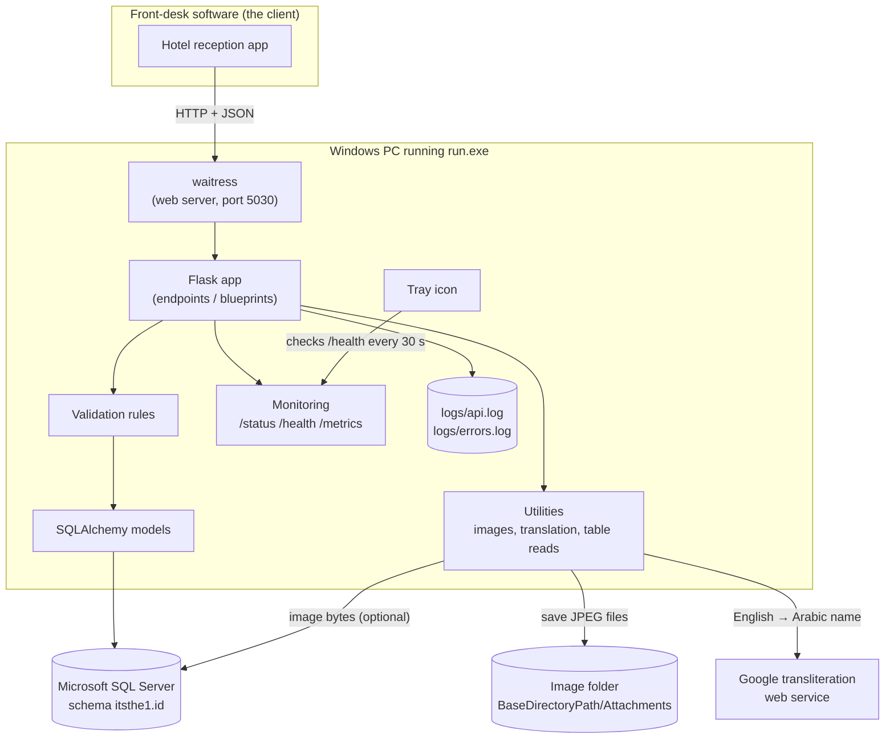

**In words:**

1. The reception app sends a request such as `POST /checkin` with JSON data.
2. **waitress** receives it and hands it to **Flask**.
3. Flask finds the right function (the "route") for that URL.
4. The function **validates** the data, then uses **models** to write rows into **SQL Server**.
5. Guest document photos are saved as JPEG files in a folder (and optionally inside the database).
6. English names are sent to a Google service to get Arabic spellings.
7. Every request is counted by the **monitoring** part and written to the **log files**.

---

## 5. Folder map — where is everything?

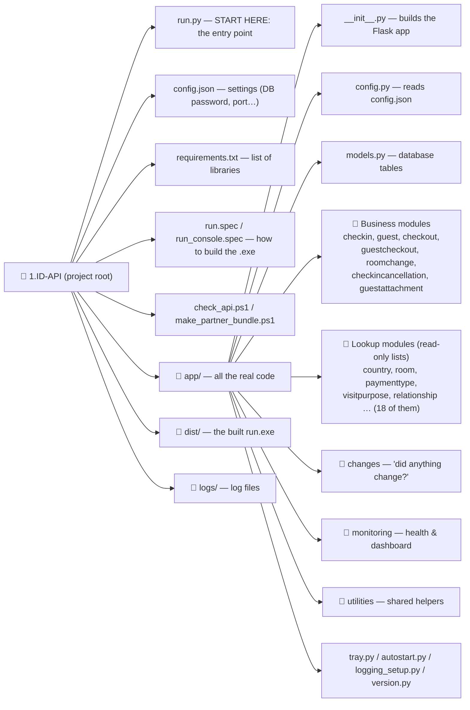

### Every module follows the same small pattern

Each folder inside `app/` (for example `app/room/`) has:

| File | Job | Example |
|---|---|---|
| `routes.py` | Defines the URL and the function that answers it. | [app/room/routes.py](../app/room/routes.py) |
| `services.py` | Reads data from the database and turns it into a dictionary. | [app/room/services.py](../app/room/services.py) |
| `__init__.py` | Makes the folder a Python package. *(Not actually used for registration; several are copy-paste leftovers.)* | |
| `validators.py` | Only in `checkin` and `guest`: small text-checking rules. | [app/guest/validators.py](../app/guest/validators.py) |

Here is a complete, real, small module so you can see how simple it is:

```python
# app/room/routes.py
room_bp = Blueprint('room', __name__)

@room_bp.route('/room', methods=['GET'])
def room():
    data = get_room_data()      # ask services.py for the data
    return jsonify(data)        # send it back as JSON
```

```python
# app/room/services.py
def get_room_data():
    return fetch_rows(
        Room,                                   # which table
        lambda room: {'Id': room.Id, 'RoomNumber': room.RoomNumber, ...},  # how each row looks
        filters={'occupied': Room.IsChecked, 'room_number': Room.RoomNumber, 'active': Room.IsActive},
    )
```

So `GET /room?occupied=1` returns only the occupied rooms.

---

## 6. What happens when you start the program

The whole start-up is in [run.py](../run.py) and [app/\_\_init\_\_.py](../app/__init__.py).

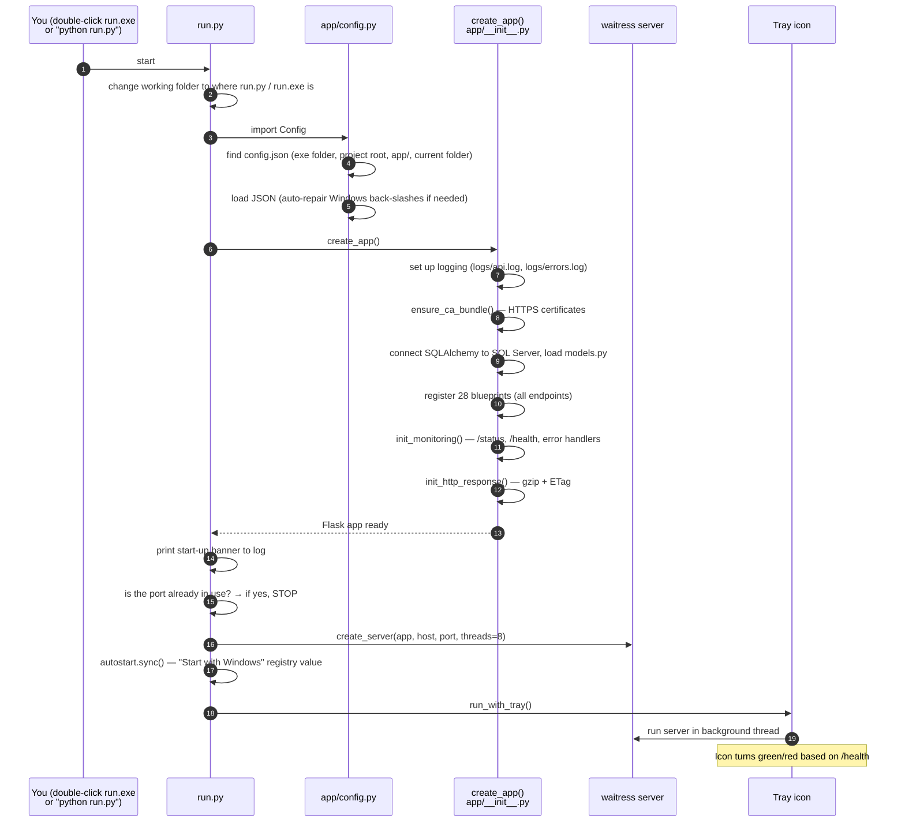

Key points:

- **config.json is searched** in this order: next to the `.exe` (if built), the project root, `app/`, then the current folder ([app/config.py:6-34](../app/config.py)).
- If no `config.json` is found, the API still starts but uses a useless empty SQLite database and logs a **CRITICAL** warning ([run.py:66-70](../run.py)).
- If another copy is already running on the same port, it **refuses to start** ([run.py:72-81](../run.py)).
- `--no-tray` runs without the tray icon (for Windows services / scheduled tasks).

---

## 7. What happens when a request arrives

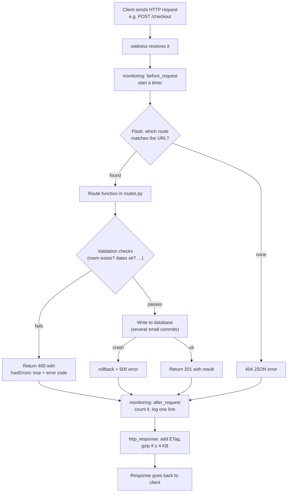

### What a response looks like

**Success** (for example after a check-in):

```json
{
  "CheckinUID": "1523",
  "guests": [{"uid": "4410", "guestCode": "G1", "attachments": [{"uid": "…", "attachmenttCode": "…"}]}],
  "requestMessageID": "99812",
  "hasErrors": false,
  "errorMessages": {},
  "messageType": "CheckinResponse",
  "clientUID": "…",
  "messageUID": "…",
  "correlationUID": "…",
  "timestamp": "…"
}
```

**Error** (for example the room is already occupied):

```json
{
  "hasErrors": true,
  "errorMessages": { "general": "40050 …" },
  "messageType": "CheckinResponse",
  "clientUID": "…", "messageUID": "…", "correlationUID": "…", "timestamp": "…"
}
```

The **first 5 digits** of the message are the error code (see [section 19](#19-glossary-of-error-codes)).

---

## 8. The database — tables and how they connect

All tables are defined in [app/models.py](../app/models.py) (lines 1–415; everything after that is old commented-out code). Every table lives in the schema set by `SCHEMA_NAME` in `config.json`.

### 8.1 The main tables (the "story" of a stay)

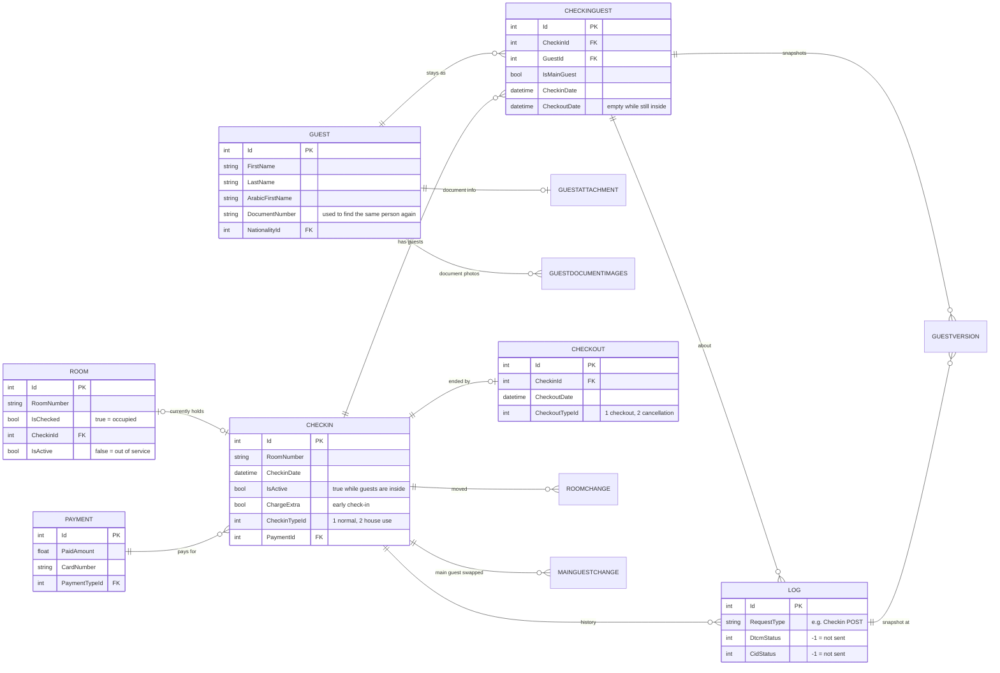

### 8.2 What each table is for (plain English)

| Table | Think of it as… |
|---|---|
| `checkin` | **One stay** in one room. `IsActive = true` while people are inside. |
| `guest` | **A person.** The same person is re-used across stays, found by their `DocumentNumber` (passport/ID number). |
| `checkinguest` | **"This person is in this stay."** The link between `guest` and `checkin`. Holds `IsMainGuest` and each person's own check-in/out time. |
| `guestattachment` | The person's **ID document details** (type, issue date, expiry, country) and a JSON list of their photo files. |
| `guestdocumentimages` | The **photo bytes** themselves (only used on some sites — see [13.1](#131-attachment_storepy--saving-document-photos)). |
| `guestversion` | A **full snapshot** of a guest's details every time something changes (an audit trail / history). |
| `log` | **One row for every write action** (check-in, checkout, room change…). Also used to check date overlaps. |
| `payment` | How the stay was paid: amount, card number, payment type. |
| `checkout` | How a stay ended. `CheckoutTypeId = 1` normal checkout, `= 2` **cancellation**. |
| `roomchange` | A record of "moved from room A to room B at time T". |
| `mainguestchange` | A record of "the main guest changed from person A to person B". |
| `room` | The hotel's rooms. `IsChecked = true` means occupied. `IsActive = false` means out of service. |

### 8.3 Lookup tables (fixed lists)

These rarely change. The client reads them to fill drop-down menus. Each has a matching `GET` endpoint.

`accessibilitytype`, `cancellationreason`, `cardtype`, `checkintype`, `checkouttype`, `country`, `documenttype`, `dtcmaction`, `emirate`, `escorttype`, `paymenttype`, `relationship`, `visitpurpose`.

---

## 9. The life of a hotel stay

This diagram shows how a **stay** (a `checkin` row) and its **room** change over time, and which endpoint causes each change.

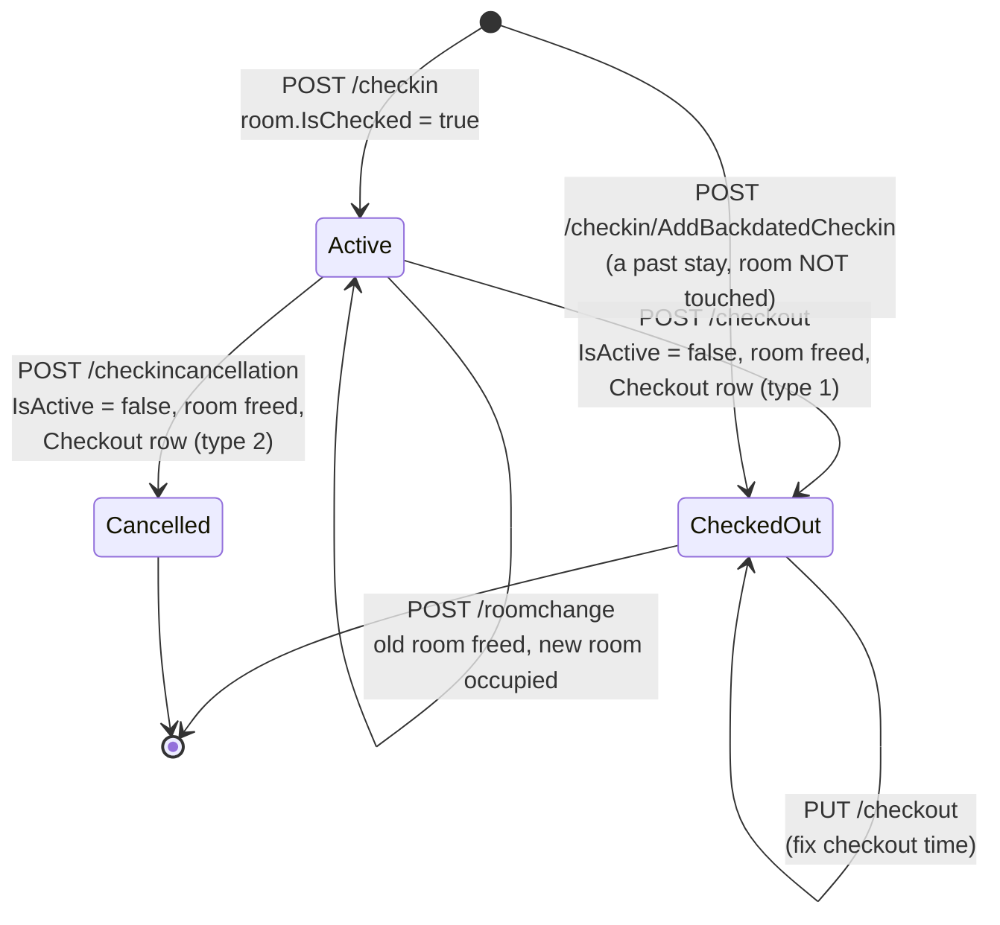

**Remember these rules:**

- Only **checkout**, **room change** and **cancellation** change a room's status. A *single* guest checking out (`/guestcheckout`) does **not** free the room.
- "Checked out" and "Cancelled" both set `checkin.IsActive = false`. The **only** difference is the `checkout.CheckoutTypeId` (1 vs 2).

---

## 10. Every endpoint, explained

The server listens on `http://HOST:PORT` (from `config.json`, e.g. `http://127.0.0.1:5030`). There is **no URL prefix**, so `/checkin` is the full path.

### 10.1 Business endpoints (they change data)

| Method & URL | What it does | Code |
|---|---|---|
| `POST /checkin` | Start a new stay: payment + stay + all guests + photos, mark room occupied. | [app/checkin/routes.py:100](../app/checkin/routes.py) |
| `PUT /checkin` | Edit an active stay and its guests. | [app/checkin/routes.py:1153](../app/checkin/routes.py) |
| `GET /checkin` | Read one stay. ⚠️ Expects a **JSON body** even though it is a GET. | [app/checkin/routes.py:49](../app/checkin/routes.py) |
| `POST /checkin/AddBackdatedCheckin` | Record a stay that already happened in the past (check-in + checkout together). | [app/checkin/routes.py:2333](../app/checkin/routes.py) |
| `POST /guest` | Add one more person (escort) to an active stay. | [app/guest/routes.py:107](../app/guest/routes.py) |
| `PUT /guest` | Edit one person on a stay. | [app/guest/routes.py:896](../app/guest/routes.py) |
| `GET /guest` | List the people on one stay (JSON body with `CheckinUID`). | [app/guest/routes.py:46](../app/guest/routes.py) |
| `POST /guestcheckout` | One person leaves early. Can hand over "main guest" to someone else. | [app/guestcheckout/routes.py:34](../app/guestcheckout/routes.py) |
| `POST /checkout` | The whole stay ends. Room becomes free. | [app/checkout/routes.py:34](../app/checkout/routes.py) |
| `PUT /checkout` | Change the checkout time of an already-finished stay. | [app/checkout/routes.py:325](../app/checkout/routes.py) |
| `POST /roomchange` | Move the stay to another room. | [app/roomchange/routes.py:36](../app/roomchange/routes.py) |
| `POST /checkincancellation` | Cancel a stay (only in the same calendar month). | [app/checkincancellation/routes.py:35](../app/checkincancellation/routes.py) |
| `POST /guestattachment` | Add more document photos to a guest (keeps existing ones). | [app/guestattachment/routes.py:45](../app/guestattachment/routes.py) |

### 10.2 "Give me the whole table" endpoints (read-only)

| URL | Table | Extra filters (`?name=value`) |
|---|---|---|
| `GET /checkintable` | checkin | `active`, `room_number` |
| `GET /guesttable` | guest | `document_number` |
| `GET /checkinguest` | checkinguest | `checkin_id`, `guest_id` |
| `GET /guestcheckout` | checkinguest | `checkin_id`, `guest_id` |
| `GET /checkout` | checkout | `checkin_id` |
| `GET /roomchange` | roomchange | `checkin_id` |
| `GET /guestattachment` | guestattachment | `guest_id` |
| `GET /guestversion` | guestversion | `checkin_id`, `guest_id` |
| `GET /log` | log | `checkin_id`, `room_number`, `request_type` |
| `GET /mainguestchange` | mainguestchange | `checkin_id` |
| `GET /payment` | payment | – |
| `GET /room` | room | `occupied`, `room_number`, `active` |
| `GET /checkincancellation` | checkout rows with type 2 | *(no parameters)* |
| `GET /guestdocumentimage` | guestdocumentimages (photos as base64) | *(no parameters)* |

All the tables above **except the last two** also accept these "read only what's new" parameters (from [app/utilities/table_query.py](../app/utilities/table_query.py)):

| Parameter | Meaning | Example |
|---|---|---|
| `since_id` | Only rows with `Id` greater than this | `/log?since_id=99722` |
| `since` | Only rows added at/after this time | `/payment?since=2026-09-01T00:00:00Z` |
| `limit` / `offset` | Paging | `/log?limit=100&offset=200` |
| `order` | `asc` or `desc` | `/log?order=desc&limit=10` |

> Why does this exist? A comment in the code explains that the `log` table grew to ~100,000 rows (27 MB of JSON), so re-reading the whole table after each checkout took over a minute. These parameters let a client read only the new rows.

### 10.3 Lookup lists (read-only, no parameters)

`GET /accessibilitytype`, `/cancellationreason`, `/cardtype`, `/checkintype`, `/checkouttype`, `/country`, `/documenttype`, `/dtcmaction`, `/emirate`, `/escorttype`, `/paymenttype`, `/relationship`, `/visitpurpose`.

### 10.4 The "has anything changed?" endpoint

`GET /changes?since=<token>&wait=<seconds>` ([app/changes/routes.py](../app/changes/routes.py))

Instead of downloading every table again and again, a client can ask this cheap question:

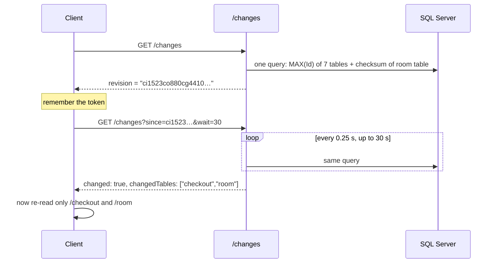

At most 3 clients can "wait" at once; `wait` is capped at 55 seconds.

### 10.5 Monitoring endpoints

| URL | What you get |
|---|---|
| `GET /` | Name, version, and links. |
| `GET /ping` | Just the word `pong`. Fastest "are you alive?" test. |
| `GET /version` | Version, Python version, process ID, start time. |
| `GET /health` | Checks config, database (`SELECT 1`) and storage folder. `200` = healthy, `503` = problem. |
| `GET /metrics` | Request counts, error counts, busiest endpoints, recent errors. |
| `POST /metrics/reset` | Reset those counters. |
| `GET /routes` | List of every URL the API has. |
| `GET /status` | A **web dashboard** you can open in a browser. It refreshes every 5 seconds. |

---

## 11. Deep dive: creating a check-in (`POST /checkin`)

This is the **most important and biggest** function in the project ([app/checkin/routes.py:100-1150](../app/checkin/routes.py)). Let's walk through it slowly.

### 11.1 What the client sends (simplified)

```json
{
  "ClientUID": "front-desk-1",
  "CorrelationUID": "abc-123",
  "CheckinUID": "external-id-77",
  "RoomNumber": "204",
  "CheckinDateTime": "2026-09-24T14:00:00",
  "PaymentMethodCode": "cash",
  "PaidAmount": 500,
  "IsHouseUse": false,
  "IsEarlyCheckin": false,
  "Guests": [
    {
      "GuestCode": "G1",
      "IsMainGuest": true,
      "FirstName": "John", "LastName": "Smith", "ArabicName": "جون سميث",
      "GenderCode": "male", "BirthDate": "1990-05-01", "BirthPlace": "London",
      "Mobile": "501234567", "Email": "john@example.com", "ResidenceCountryPhone": "",
      "NationalityCode": "GB", "ResidenceCountryCode": "GB",
      "VisitPurposeCode": "…", "CheckinDateTime": "2026-09-24T14:00:00",
      "DocumentNumber": "X1234567", "AttachmentTypeCode": "…",
      "IssueDate": "2020-01-01", "ExpiryDate": "2030-01-01", "IssueCountryCode": "GB",
      "RequiresAccessibility": false,
      "Attachments": [{ "AttachmentCode": "…", "Name": "passport.jpg", "ContentBase64Encoded": "…" }]
    }
  ]
}
```

(For the exact field list see [section 11.5](#115-all-request-fields).)

### 11.2 The flow as a picture

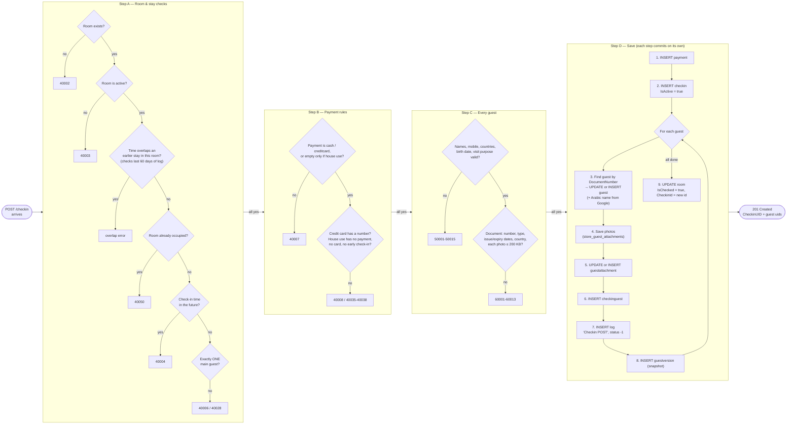

### 11.3 The same flow, step by step, in plain English

**Step A — Is the room OK?**

1. Look up the room by `RoomNumber`. If it doesn't exist → error **40002**.
2. If the room is switched off (`IsActive = false`) → **40003**.
3. Check that the check-in time doesn't clash with another stay in the same room. The function `checkin_date_time_overlap_status` ([routes.py:3516](../app/checkin/routes.py)) reads the room's `log` rows from the last **60 days** and compares times.
4. If the room is already occupied (`IsChecked = true`) → **40050**.
5. The check-in time can't be in the future → **40004**.
6. There must be **exactly one** main guest → **40006 / 40028**.

**Step B — Is the payment OK?**

| Rule | Error |
|---|---|
| `PaymentMethodCode` must be `cash` or `creditcard`. It may be empty only when `IsHouseUse` is true. | 40007 |
| `creditcard` needs a `CreditCardNumber`. | 40008 |
| "House use" (a free stay, e.g. staff) must **not** have a payment method, a card number, early check-in or "waiting for room". | 40035–40038 |

**Step C — Is every guest OK?**

- `validate_guest()` ([app/checkin/services.py:40](../app/checkin/services.py)) checks the *format*: names use English letters only, `ArabicName` uses Arabic letters only, mobile is digits only, email has an `@`, document number is letters and digits.
- Then a long list of checks: country codes must exist in the `country` table, relationship code must exist (for escorts), birth date must not be in the future, the document must not be expired, each photo must be at most 200 KB, and so on.

**Step D — Save everything.** Done in this order:

1. A **payment** row. The payment type is looked up by code (or defaults to `1`).
2. A **checkin** row with `IsActive = true`. `CheckinTypeId` is `2` for house use, otherwise `1`.
3. For **each guest**:
   - Look for an existing `guest` with the same `DocumentNumber`. If found, **update** it; otherwise **create** a new one. The Arabic first/last names come from the Google transliteration service.
   - Save the document **photos** to disk (and maybe to the database).
   - Save the **document details** (`guestattachment`).
   - Create a **checkinguest** row that links this person to this stay.
   - Write a **log** row (`RequestType = "Checkin POST"`).
   - Write a **guestversion** snapshot.
4. Mark the **room** as occupied.

### 11.4 How a guest's data flows into the tables

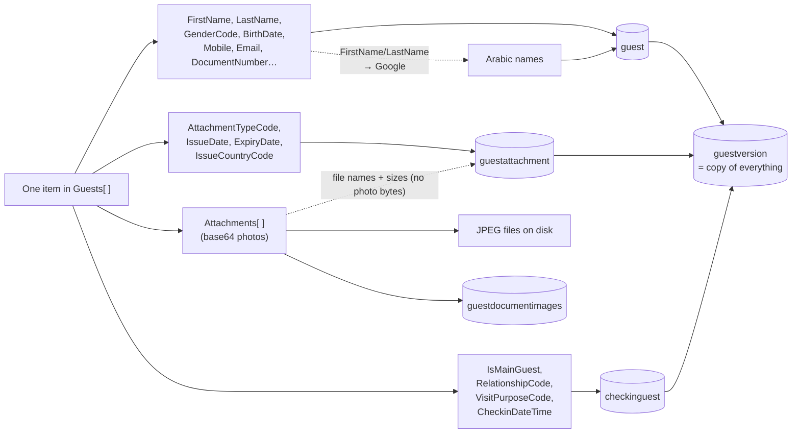

### 11.5 All request fields

**Top level:** `ClientUID`, `CorrelationUID`, `CheckinUID`, `RoomNumber`, `CheckinDateTime`, `PaymentMethodCode`, `CreditCardNumber`, `CreditCardTypeCode`, `PaidAmount`, `IsHouseUse`, `IsEarlyCheckin`, `IsWaitingForRoom`, `Guests`.

**Per guest:** `GuestCode`, `IsMainGuest`, `RelationshipCode`, `FirstName`, `LastName`, `ArabicName`, `GenderCode`, `BirthDate`, `BirthPlace`, `Mobile`, `ResidenceCountryPhone`, `Email`, `NationalityCode`, `ResidenceCountryCode`, `VisitPurposeCode`, `CheckinDateTime`, `DocumentNumber`, `AttachmentTypeCode`, `IssueDate`, `ExpiryDate`, `IssueCountryCode`, `EmirateCode` (needed when the issue country is `AE`), `RequiresAccessibility`, `AccessibilityTypes` (`[{"Code": …}]`), `OtherAccessibilityType`, `Attachments` (`[{"AttachmentCode", "Name", "ContentBase64Encoded"}]`).

### 11.6 How `PUT /checkin` and the backdated check-in differ

| | `POST /checkin` | `PUT /checkin` | `POST /checkin/AddBackdatedCheckin` |
|---|---|---|---|
| Purpose | New live stay | Edit a live stay | Record a past stay |
| Identifies the stay by | – (creates new) | `UID` = checkin Id | – (creates new) |
| Room must be free? | Yes (40050) | Not checked | Not checked |
| New payment row? | Yes | Updates the existing one | Yes |
| Guests | Created or updated | Must already exist (else **50018**) | Created or updated |
| `checkin.IsActive` | `true` | `true` | **`false`** |
| Creates a `checkout` row? | No | No | **Yes** |
| Changes the room? | Occupied | No | No |

---

## 12. Deep dive: the other write operations

### 12.1 Adding a person to a stay — `POST /guest`

It uses almost the same guest checks as `POST /checkin`, but for **one** guest (`GuestInfo`). The stay must be active (**40011**). A person with the same `DocumentNumber` already on this stay → **50016**.

Saves in order: `guest` → photos → `guestattachment` → **new** `checkinguest` → `log` ("Guest POST") → `guestversion`.

`PUT /guest` does the same but **updates** the existing `checkinguest` instead of inserting one.

### 12.2 One person leaves — `POST /guestcheckout`

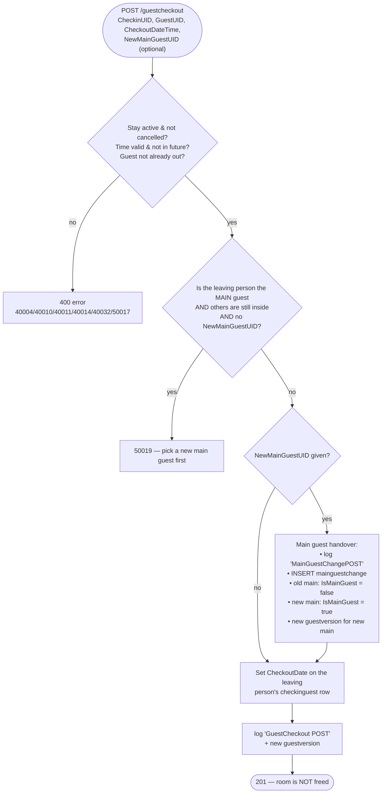

### 12.3 Everybody leaves — `POST /checkout`

1. **Checks:** `CheckoutDateTime` is required. It must be after every guest's check-in time and after every earlier guest checkout, room change and main-guest change. The stay must exist (**40009**), not be cancelled (**40010**), and be active (**40011**). The time can't be in the future (**40004**). House use can't have a late checkout (**40039**).
2. `checkin.IsActive = false`.
3. The **room is freed**: `IsChecked = false`, `CheckinId = null`.
4. `INSERT checkout` with `CheckoutTypeId = 1`, `ChargeExtra = IsLateCheckout`.
5. Every guest still inside gets this `CheckoutDate`.
6. `INSERT log` ("Checkout POST").

`PUT /checkout` only works on a stay that is **already** checked out (otherwise **40031**) and changes the time.

### 12.4 Moving rooms — `POST /roomchange`

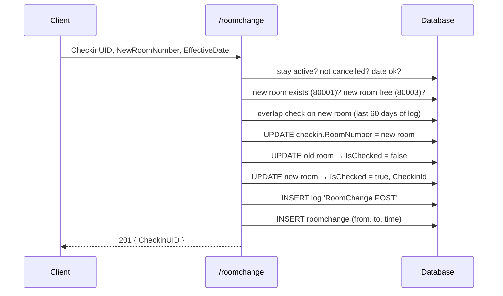

### 12.5 Cancelling — `POST /checkincancellation`

- The stay must be active and not already cancelled.
- The cancellation time must be after the check-in time (**40025**) and not in the future (**40004**).
- **Same month rule:** it is rejected if the current month number is later than the check-in's month number ([routes.py:128](../app/checkincancellation/routes.py)).
- Saves: `checkin.IsActive = false` → room freed → all guests get a checkout time → `log` → `checkout` row with **`CheckoutTypeId = 2`** and the `CancellationReasonId` (found by `CancellationReasonCode`).

### 12.6 Adding more photos — `POST /guestattachment`

It adds new photos **without deleting** the old ones. If a new photo has the same name as an existing one, it is saved as `Name_1.jpg`, `Name_2.jpg` and so on. Then it writes a `log` ("GuestAttachment POST") and a new `guestversion`.

---

## 13. Helper tools (`app/utilities`)

### 13.1 `attachment_store.py` — saving document photos

[app/utilities/attachment_store.py](../app/utilities/attachment_store.py) is **the one place** that saves a guest's document photos. It is used by check-in, guest and guestattachment.

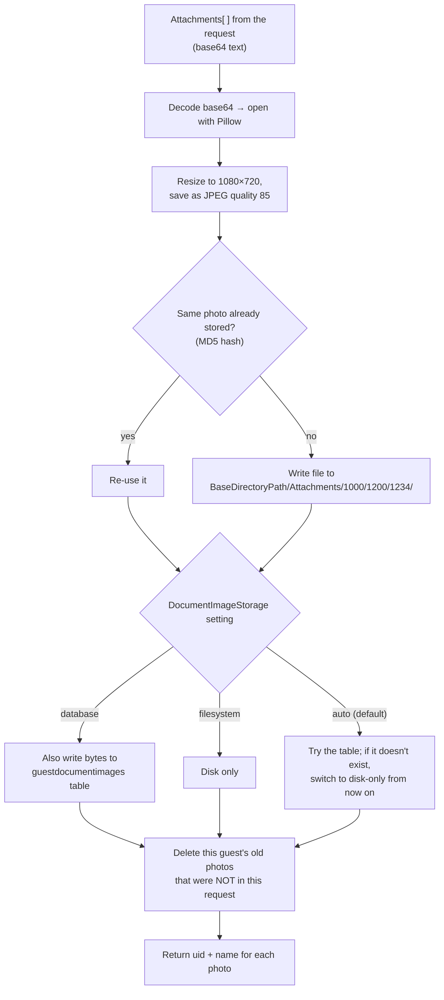

**Folder layout:** a guest with Id `1234` gets the folder `Attachments\1000\1200\1234\` (thousands\hundreds\id), so no single folder gets too many sub-folders ([image_manipulator.py:264-321](../app/utilities/image_manipulator.py)).

### 13.2 `translation.py` — English to Arabic names

[app/utilities/translation.py](../app/utilities/translation.py) — `translate_to_arabic("John")` calls:

```
GET {GOOGLE_TRANSLATOR_URL}?tlqt=1&langpair=en|ar&text=John
```

It waits at most 5 seconds. If anything fails, it returns the **English** name instead (never an error). The result is cut to 45 characters to fit the database column.

### 13.3 `table_query.py` — fast table reads

`fetch_rows()` powers all the "whole table" GET endpoints. It reads with plain SQL (SQLAlchemy Core), which is faster than building ORM objects. It adds the `since_id`, `since`, `limit`, `offset`, `order` and filter parameters. A bad value (like `limit=abc`) returns a **400**.

### 13.4 `http_response.py` — smaller, cacheable responses

For any successful response of 4 KB or more, it adds an **ETag** (a fingerprint). If the client sends the same fingerprint back (`If-None-Match`), the API answers **304 Not Modified** with no body. It also **gzips** the response if the client supports it.

### 13.5 `ca_bundle.py` — HTTPS certificates for the `.exe`

When packed as one `.exe`, the security certificates are unpacked into a temporary folder that Windows may clean up while the program is running. This helper copies them to `certs\cacert.pem` next to the exe, so the translation calls keep working.

---

## 14. Monitoring, logs and the tray icon

### 14.1 How requests are counted

[app/monitoring/routes.py](../app/monitoring/routes.py) adds two "hooks" that run around **every** request:

- **before_request:** remember the start time.
- **after_request:** work out how long it took, add it to the counters in [metrics.py](../app/monitoring/metrics.py), and write one line to the log.

A response that says `200` but contains `"hasErrors": true` is still counted as an **error** (a "soft error").

The counters live **in memory** only. They reset when the program restarts.

### 14.2 The `/status` dashboard

Open `http://127.0.0.1:<PORT>/status` in a browser. It shows cards for Uptime, Requests served, Failed responses, DB response time, Host and Process ID, plus lists of recent requests, recent errors and the busiest endpoints. It refreshes every 5 seconds.

### 14.3 Log files

Set up in [app/logging_setup.py](../app/logging_setup.py):

| File | Contains |
|---|---|
| `logs/api.log` | Everything (level set by `LOG_LEVEL`, default INFO). |
| `logs/errors.log` | Only warnings and errors. |

Each file rotates at 5 MB and keeps 5 old copies (both settings can be changed). The line format is `2026-09-24 14:00:00 INFO     [itsthe1.api] message`.

### 14.4 The tray icon

[app/tray.py](../app/tray.py) shows a coloured circle near the Windows clock:

- 🟢 green = healthy, 🔴 red = problem, ⚪ grey = not checked yet (it re-checks every 30 seconds).

Right-click menu:

```
ITSthe1.ID API v<version>      (label)
Listening on 127.0.0.1:5030    (label)
───────────────
Open status page               (default, double-click)
Open log folder
Refresh health
☑ Start with Windows
───────────────
Quit
```

**Start with Windows** ([app/autostart.py](../app/autostart.py)) writes the value `ITSthe1.ID API` under the registry key `HKEY_CURRENT_USER\Software\Microsoft\Windows\CurrentVersion\Run`, and saves `StartWithWindows` back into `config.json`.

---

## 15. Configuration (`config.json`)

Copy `config.example.json` to `config.json` and fill it in. **Never share a filled-in `config.json`**: it contains the database password in plain text.

| Setting | Meaning | Default if missing |
|---|---|---|
| `SQLALCHEMY_DATABASE_URI` | How to connect to SQL Server (user, password, server, database, driver). | `sqlite:///default.db` (useless) |
| `SCHEMA_NAME` | Database schema, e.g. `[itsthe1.id].[itsthe1.id]`. | `[default_schema]` |
| `BaseDirectoryPath` | Folder where document photos are saved. | `C:/DefaultPath` |
| `GOOGLE_TRANSLATOR_URL` | Web address used for Arabic names. | `https://google.com/transliterate/indic` |
| `DocumentImageStorage` | `auto`, `database` or `filesystem` (see 13.1). | `auto` |
| `HOST` / `PORT` | Where the API listens. | `0.0.0.0` / `5000` |
| `StartWithWindows` | Start automatically at login. | `true` |
| `DB_CONNECT_TIMEOUT` | Seconds to wait for the database. | `5` |
| `LOG_DIR`, `LOG_LEVEL`, `LOG_MAX_BYTES`, `LOG_BACKUP_COUNT` | Logging options. | `logs`, `INFO`, 5 MB, 5 |
| `REQUEST_HISTORY_SIZE` | How many recent requests the dashboard remembers. | `50` |

> **Tip about Windows paths:** in JSON, write `C:/ITSthe1/Storage` (forward slashes) or `C:\\ITSthe1\\Storage` (double backslashes). The code tries to repair single backslashes automatically and logs a warning when it does ([app/config.py:46-195](../app/config.py)).

---

## 16. Building the `.exe` and other scripts

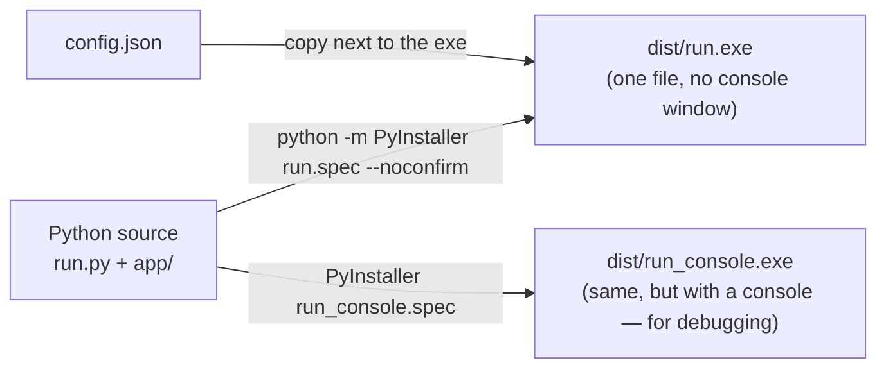

| File | What it does |
|---|---|
| [run.spec](../run.spec) | PyInstaller recipe: one-file exe, no console, includes certificates and all hidden imports. |
| [run_console.spec](../run_console.spec) | Same recipe, but the exe opens a console window so you can see start-up errors. |
| [check_api.ps1](../check_api.ps1) | Calls `/ping`, `/version` and `/health`, prints the results, and exits with `0` if healthy or `1` if not. Good for scheduled tasks. |
| [make_partner_bundle.ps1](../make_partner_bundle.ps1) | Creates a zip for partners with the README, example config, requirements, check script and docs. Add `-IncludeSource` to also include the code. It never includes `config.json` or logs. |
| `Build App CMD.txt` | Just the build command: `python -m PyInstaller run.spec --noconfirm`. |

---

## 17. How to run it yourself

**From source (for development):**

```bash
pip install -r requirements.txt
```

```bash
python run.py
```

Then open `http://127.0.0.1:5030/status` (use the `PORT` from your `config.json`).

**Without the tray icon (foreground):**

```bash
python run.py --no-tray
```

**Check that it is healthy:**

```bash
powershell -File check_api.ps1 -Port 5030
```

**Try a simple read:**

```bash
curl http://127.0.0.1:5030/room?occupied=1
```

You need: Windows, Python 3, the **ODBC Driver 17 for SQL Server**, and access to the SQL Server database named in `config.json`.

---

## 18. Things to watch out for (found in the code)

These came up while reading the source. They are useful to know before you change anything.

| # | What | Where | Why it matters |
|---|---|---|---|
| 1 | **Saves happen in many small commits, not one transaction.** | All write endpoints | If step 5 of 9 fails, steps 1–4 stay saved. You can end up with, for example, a payment and a check-in row with no guests. |
| 2 | **`timestamp` and some `AddedAt` values are fixed at start-up.** `local_time_str` is calculated once when the module loads. | e.g. [checkin/routes.py:33-39](../app/checkin/routes.py) | Every response and log row shows the time the server **started**, not the time of the request. |
| 3 | `app/checkin/routes_copy.py` (3,579 lines) is **never imported**. | – | It is dead code. Don't edit it thinking it will change anything. |
| 4 | `GET /checkin` and `GET /guest` read a **JSON body**. | checkin/guest routes | Many tools and browsers don't send a body with GET. |
| 5 | `IsHouseUse` defaults to **true** in one check. | [checkin/routes.py:290](../app/checkin/routes.py) | Always send `"IsHouseUse": false` explicitly, or a normal paid check-in may be rejected with 40035. |
| 6 | `PUT /checkout` looks up the room with `Room.query.get(RoomNumber)`, i.e. by **Id**, using a room **number**. | [checkout/routes.py:565-568](../app/checkout/routes.py) | It may free the wrong room, or no room. |
| 7 | The cancellation "same month" rule compares **month numbers only**, not years. | [checkincancellation/routes.py:128](../app/checkincancellation/routes.py) | A December check-in can still be cancelled the following January. |
| 8 | Several endpoints read `checkin.IsActive` **before** checking that the check-in exists. | guest, roomchange, guestcheckout, checkincancellation… | A wrong `CheckinUID` gives a **500** instead of the intended "40009 not specified" error. |
| 9 | `CheckinGuest.IsFirstGuest` is always `true` and `EscortTypeId` is always `2`. | check-in and guest routes | Those columns don't carry real information. |
| 10 | The response key is spelled **`attachmenttCode`** (two t's). | check-in / guest responses | Clients must use this exact spelling. |
| 11 | Missing `ArabicName` fails validation, because an empty value "is not Arabic". | [checkin/validators.py](../app/checkin/validators.py) | In practice `ArabicName` is **required**, even though the stored Arabic names come from Google. |
| 12 | Some `__init__.py` files define blueprints with the wrong names (copy-paste). | e.g. `app/cardtype/__init__.py` | Harmless, because the blueprint that is registered comes from `routes.py`, but it is confusing. |

---

## 19. Glossary of error codes

The code number appears at the start of `errorMessages.general`.

| Code | Meaning (from the code) |
|---|---|
| **40002** | Room does not exist |
| **40003** | Room is not active / not available |
| **40004** | Date/time is in the future (or invalid) |
| **40005** | No guests were sent |
| **40006 / 40028** | There must be exactly one main guest |
| **40007** | Payment method missing or not `cash` / `creditcard` |
| **40008** | Credit card number missing |
| **40009** | Check-in not specified |
| **40010** | Check-in was cancelled |
| **40011** | Check-in is not active (already checked out) |
| **40014** | Checkout date/time missing |
| **40023** | `CheckoutDateTime` must not be sent on `PUT /checkin` |
| **40025** | Cancellation time is before the check-in time |
| **40031** | `PUT /checkout` on a stay that is still active |
| **40032 / 40034** | Checkout time is before a check-in or earlier checkout |
| **40033** | No guest has the same check-in time as the stay |
| **40035–40038** | House-use rules broken (payment, card, early check-in, waiting room) |
| **40039** | House use cannot have late checkout |
| **40050** | Room is already occupied |
| **50001–50015** | Guest field problems (name, mobile, country, birth date, visit purpose, check-in time…) |
| **50016** | Guest already exists on this stay |
| **50017** | Guest has already checked out |
| **50018** | Guest is not on this check-in (`PUT /checkin`) |
| **50019** | Main guest can't leave while others stay unless `NewMainGuestUID` is given |
| **60001–60013** | Document/photo problems (missing, wrong type, dates, country, emirate, photo > 200 KB) |
| **80001** | New room (room change) does not exist |
| **80003** | New room (room change) is already occupied |

---

*End of guide. If you change the code, please update the matching section here.*
